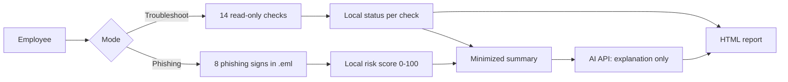

# it-support-copilot
AI assisted Windows troubleshooting and phishing email analysis for first-level IT support.
 ## Local checks and decides. The AI only explains.

In first-level IT support, many tickets start like 'the internet doesn't work' or 'is this email real?'. I built a tool that answers these basic questions automatically, explains the results in plain language for the employee, and hands IT a ready-made ticket summary. One rule shaped the whole design. "AI must never make security decisions, so fixed local rules decide and the AI only explains".

I planned, built, tested and documented the project independently, as a small but complete IT project from idea to release. 

## What it does

| Mode | For the employee | For IT |
|---|---|---|
| **Troubleshoot** | 14 read-only checks (network, system, security), traffic-light report, up to 3 safe steps to try | Ticket summary with suspected cause |
| **Phishing check** | Risk score 0 to 100 for a saved email, clear "what to do" advice | Technical findings: SPF/DKIM/DMARC, look-alike domains, link mismatches, dangerous attachments |


## Skills I wanted to demonstrate

| Area | Where it shows in this project |
|---|---|
| **Windows / client administration** | Checks for Defender, firewall, BitLocker, Windows updates, disk, memory, uptime and local administrators via PowerShell and CIM |
| **Networking** | Step-by-step diagnosis of adapter, DHCP address, gateway, DNS and internet; a real DNS fault was reproduced and detected |
| **Microsoft 365 and email security** | Analysis of email headers (SPF, DKIM, DMARC) and typical Microsoft 365 phishing lures |
| **Cloud technologies** | Integration of a cloud AI API over HTTPS with JSON, with graceful fallback when it is unavailable |
| **IT security** | Rule-based decisions, prompt injection tests, HTML encoding, data minimization, no secrets in code |
| **Testing and documentation** | 15 documented test cases, architecture and security docs, this README |
| **Service orientation** | Plain-language explanations and safe next steps for non-technical employees, in English or German |

## How it works



Details: [docs/architecture.md](docs/architecture.md)


## Quick start

### 1. Clone the repository

```powershell
git clone https://github.com/<your-user>/it-support-copilot.git
cd it-support-copilot
```

### 2. Set your Anthropic API key

This project uses the Anthropic API for AI-powered explanations.

Set your own API key as a Windows environment variable:

```powershell
[Environment]::SetEnvironmentVariable("ANTHROPIC_API_KEY", "<your-api-key>", "User")
```

Replace `<your-api-key>` with your own Anthropic API key.

**Do not commit or share your API key.**

### 3. Start the application

```powershell
.\src\start-Copilot.ps1
```

Alternatively, double-click:

```text
Run-Copilot.cmd
```

Requires Windows 10/11 and PowerShell.

## Command-line parameters

| Parameter | Meaning |
|---|---|
| `-Mode Troubleshoot` or `-Mode Phishing` | Skip the menu and start the selected mode directly |
| `-EmailFile <path>` | Email file to check (`.eml`) |
| `-Language German` | Show the explanation in German |
| `-ScenarioFile <path>` | Simulate broken results for testing |
| `-NoAI` | Run without the AI explanation |
| `-NoOpen` | Do not open the report automatically |

## Testing

15 documented test cases, including:

- A real DNS fault
- Simulated security failures
- A prompt injection email
- An HTML injection attempt

See all test cases in [`docs/test-cases.md`](docs/test-cases.md).

## Project structure

```text
Run-Copilot.cmd         Double-click launcher
src/Start-Copilot.ps1   Entry point and menu
src/Common.ps1          Check helper, AI client, HTML report
src/Diagnostics.ps1     Windows troubleshooting checks
src/Phishing.ps1        Email analysis
samples/                Test emails and scenarios
docs/                   Architecture, security and test cases
```

## Known limitations

- Phishing detection is rule-based and can miss well-made attacks or flag harmless newsletters.
- Only `.eml` files are supported. Outlook `.msg` files and base64-encoded email bodies are not decoded yet.
- BitLocker status requires administrator rights.
- In AI mode, a shortened version of the email text is sent to an external API. Use `-NoAI` for sensitive emails.

## Roadmap

- Deploy via Microsoft Intune and collect reports centrally
- Report phishing directly to IT via Microsoft Graph
- Add Pester unit tests for all checks
- Build an AI helpdesk agent for Microsoft 365 (Entra ID, Graph) that can automate password resets and access requests with human approval

## What I learned

- A "no internet" complaint can have very different causes. Checking the adapter, IP address, gateway and DNS in order shows exactly where the fault occurs. A broken DNS server can look like a dead internet connection while the network itself is working.
- How SPF, DKIM and DMARC appear in real email headers, and why a familiar display name such as "Microsoft" does not prove that the sender is legitimate.
- Why an AI should not make security decisions: an email can contain hidden instructions aimed at the AI, so the security verdict has to come from rules that the AI cannot influence.
- How to handle secrets properly: API keys belong in environment variables, never in source code or Git history.
- How to write for two audiences: plain-language explanations for employees and concise technical information for IT.

## Author

**Bertsetseg Enkhbayar**  
B.Sc. Informatik Studentin at FOM Cologne  
[LinkedIn](<https://www.linkedin.com/in/bertsetseg-enkhbayar/>)

## License

MIT
